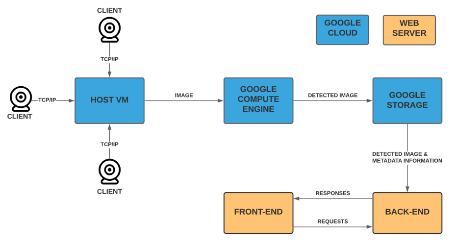
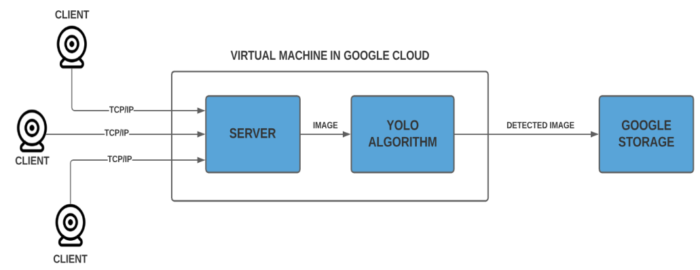
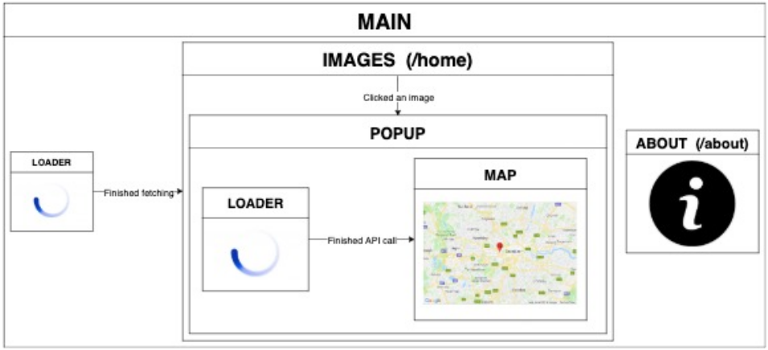

# Smoking Detection System based on Image Processing with Deep Learning and Cloud Computing

## Purpose of the Project

The goal to be achieved in this project is to identify smoking situations in places where smoking is prohibited by using image processing and deep learning approaches. Gas stations and bus stops are the main points where the smoking ban is violated.

## General Project Architecture



## Web Application architecture



## React Application components




## Running the Project

### Object Detection Section

In a virtual machine, in the directory `yolo-object-detection/yolo`, start the process for detecting objects:
```bash
python3 yolo_vm.py
```


In a client environment, in the same directory, to start the client's video by opening a camera:

``` bash
python3 client.py
``` 

Then, to upload the detected images to Google Cloud Storage:

```bash
python3 toBucket.py
```

### Web Application Section

1. Install the latest `node` and `yarn` on your operating system.
2. Change directory to project's root directory.
3. Enter this command in command line:
```bash
yarn
````

4. Change directory to `client` folder:
```bash
cd client
```

5. Enter this command:
```bash
yarn
````

6. Change directory to project's root directory again:
```bash
cd ..
```

7. To start both the React and the Node.js parts:
```bash
yarn dev
```

8. To start only Node.js:
```bash
yarn server
```

9. To start only React:
```bash
yarn client
```

10. To view React page, open a browser and search `localhost:3000`.

11. To see Node.js API interactions, open a new tab and search `localhost:5000`.